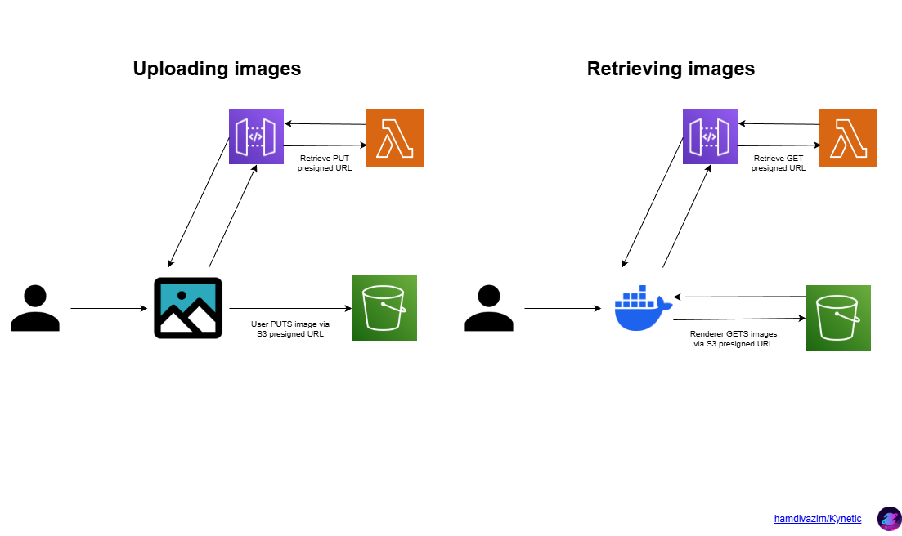

# kynetic-editor

`kynetic-editor` is a cloud-based editor for creating video projects for `kynetic-renderer`.

## Folder structure
`/app` - Next.js frontend app
`/aws` - architecture and planning docs
`/cdk` - AWS CDK IaaC code

## How To Deploy
- Clone this repository then navigate to `editor\cdk` in your CLI.
- Then follow the instructions [here](cdk/README.md) (`cdk/README.md`).

## AWS Architecture
Below is the document located at [`aws/ARCHITECTURE.md`](aws/ARCHITECTURE.md).

### Services
- API Gateway - exposes Lambda endpoints
- Lambda - generate pre-signed URLs for S3 uploads/downloads
- S3 - store user-uploaded media
- IAM - Role for Lambda to have least-privilege access to S3

### Architecture Diagram

### Data Flow
1. User enters API Gateway URL + API key
2. Editor requests pre-signed URL from Lambda
3. Editor uploads media to S3 directly
4. Editor stores JSON locally and references S3 media
5. Renderer fetches media at render using pre-signed URLs

### Security Considerations
- BYOC and CDK template ensures all data is in user account
- API keys stored locally in browser
- No personal data is handled by the app

### Cost Considerations
- Serverless model keeps costs minimal
- Users pay for S3 storage
- Lambda invocations are lightweight and event-driven