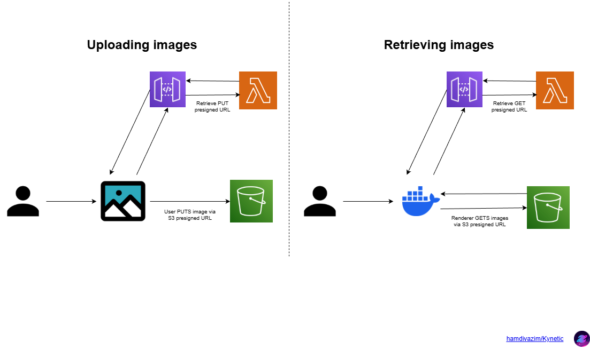

# Kynetic on AWS

The AWS side of Kynetic is deliberately small: one stack that gives you a private S3
bucket for SVG assets and an API that hands out presigned URLs so uploads and
downloads never proxy through a server. Everything runs in your own account (BYOC),
and the whole thing is optional.

Deploy it with the CDK app in [`../cdk`](../cdk) — the step-by-step guide is in
[../cdk/README.md](../cdk/README.md).

## Services

| Service | Role |
| --- | --- |
| API Gateway | Exposes the four URL routes. Uses a usage plan: 10 requests/second, burst 2. |
| Lambda | Four Python 3.11 functions that generate presigned URLs: `get_url` / `put_url` (renderer-facing) and `get_url_frontend` / `put_url_frontend` (browser-facing, with CORS on every response and `Content-Type` signed into PUTs). |
| S3 | One private bucket (all public access blocked) for uploaded media, with a CORS rule allowing browser PUT/GET/HEAD. |
| IAM | Each Lambda gets read or write access to the bucket and nothing else. |

## Architecture diagram

An editable `.drawio` source and a `.pdf` export sit alongside this file.

## Data flow

1. You enter the API Gateway URL and API key in the editor's AWS Setup dialog; both
   are stored in the browser's localStorage.
2. The editor asks Lambda for a presigned URL (`PUT` for uploads, `GET` for reads).
3. The browser uploads or downloads the file directly against S3.
4. The project JSON stays local and references the asset as `s3://name.svg`.
5. At render time, the renderer resolves the same kind of presigned URL through the
   `get-url` route and fetches the asset into a temp directory.

## Security considerations

- The CDK template deploys into your account; your data never leaves your
  own S3 bucket.
- The API key lives in localStorage and is only sent as
  the `X-Api-Key` header. Every route requires it and is throttled by the usage plan.
- Lambda roles grant least privillege read or write on the single bucket.
-`allowed_origins` is `*` in both the CDK stack and
  the Lambda headers. Before deploying publicly, replace `*` with the origin(s) where you host the editor. This restricts browser cross-origin requests from other origins; it does not replace API authentication or prevent non-browser clients from calling the API. (see the warning in
  [../cdk/README.md](../cdk/README.md)).

## Cost considerations

- Serverless: no always-on compute, so an idle setup costs essentially
  nothing beyond S3 storage.
- Presigned URLs mean file transfers go straight to S3. No data-processing bill on
  the way through the API.
- Lambda invocations are lightweight (a boto3 call and a JSON response).
